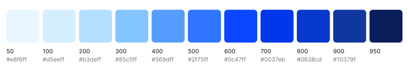
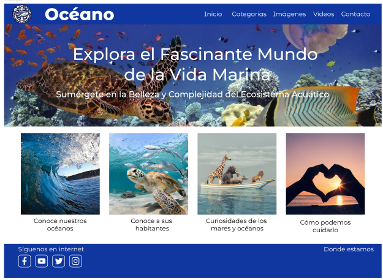
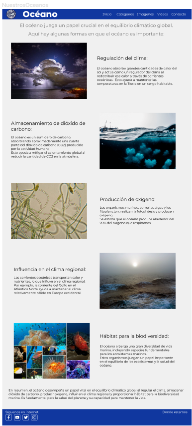
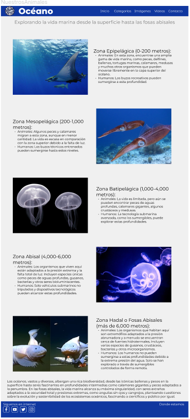
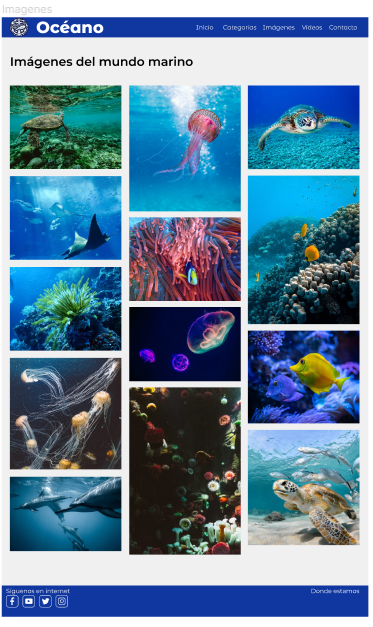
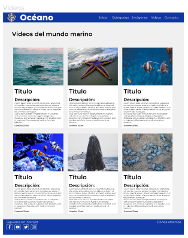
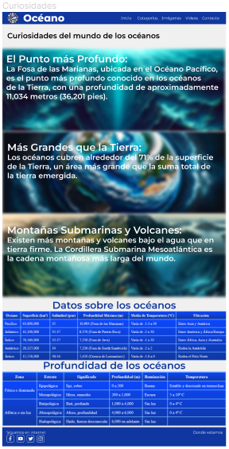
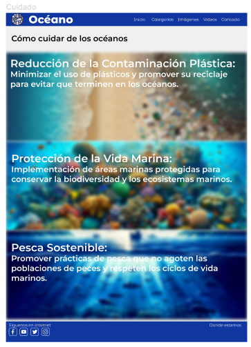
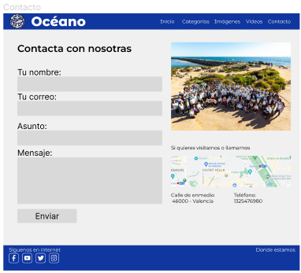

# Proyecto Océano
## https://oceanos.vercel.app
## 1. INTRODUCCIÓN 

1.1. Justificación 

- Una organización sin fines de lucro dedicada a la conservación marina necesita una plataforma en línea para difundir información sobre la importancia de cuidar los océanos y la vida marina. 
  La página web deberá servir como una herramienta educativa para involucrar a la comunidad en proyectos de conservación y recaudación de fondos.

1.2. Objetivos

1. Concientización y Educación: Uno de los objetivos principales sería aumentar la conciencia pública sobre la importancia de los océanos y la necesidad de su conservación. 
   La página web proporcionará información educativa detallada sobre los ecosistemas marinos, la biodiversidad y los desafíos que enfrentan.

2. Promoción de la Conservación: La página web servirá como una plataforma para promover proyectos y programas de conservación específicos que la organización lleva a cabo. 
   Esto incluiría detalles sobre proyectos de limpieza de playas, programas de rehabilitación de vida marina, etc.

3. Recaudación de Fondos: La organización depende de donaciones para financiar sus actividades, la página deberá tener como objetivo facilitar la recaudación de fondos en línea. 
   Hay que incluir opciones para donar en línea, patrocinios corporativos y campañas de recaudación de fondos.

4. Comunidad en línea: Fomentar la creación de una comunidad en línea comprometida con la conservación marina. 
   Esto podría incluirá redes sociales para conectarse con personas interesadas en el tema.

5. Información Accesible: Asegurarse de que la información sea fácilmente accesible y comprensible para un público diverso. 
   Esto implica la creación de contenido en diferentes formatos, como artículos, videos, infografías y más, para llegar a una amplia audiencia.

- 1.2.1. Características de la aplicación

Características de la página web de la organización sin fines de lucro dedicada a la conservación marina:

La página web de la organización presenta una página principal que sirve como punto central de acceso al contenido más relevante relacionado con la conservación marina. 
En esta página principal, los visitantes se encuentran con una imagen destacada de un fondo marino con el título **"Explora el Fascinante Mundo de la Vida Marina"**.
En la parte superior un navegador Que nos lleva a diferentes galerías de imágenes y de videos. También se cuenta con un menú desplegable que nos lleva a diferentes galerías de animales según categorías. Al final  hay un enlace para contactar.

A continuación, se ofrece una galería de imágenes que nos lleva a las siguientes secciones:
- Conoce nuestros océanos, donde se ofrece información variada sobre los océanos. 
- Conoce a sus habitantes donde se puede ver una breve explicación de los animales que viven según la profundidad. 
- Curiosidades de los océanos donde se ofrecen datos curiosos de los océanos. 
- Cómo podemos cuidarlo donde se muestra acciones que se pueden hacer para no contaminar los océanos.

La página web concluye con información de contacto, incluyendo una dirección de correo electrónico y un formulario de contacto. 
Esto permite a los visitantes ponerse en contacto con la organización para hacer preguntas o expresar su interés en apoyar la conservación marina.

Además de la página principal, la web ofrece siete páginas adicionales donde los usuarios pueden navegar para obtener información detallada sobre diversos aspectos de la conservación marina:

1. Historia de la Organización: Aquí, los visitantes pueden aprender sobre los orígenes y el desarrollo de la organización en su misión de proteger los océanos.

2. Ecosistemas Marinos: Esta página proporciona información detallada sobre los diferentes ecosistemas marinos y su importancia para el equilibrio ambiental.

3. Biodiversidad Marina: Se enfoca en la diversidad de vida marina y destaca la necesidad de conservarla.

4. Programas de Conservación: Aquí, se detallan los proyectos y programas específicos que la organización realiza para preservar los océanos.

5. Cómo Ayudar: Esta sección ofrece a los visitantes oportunidades para involucrarse, como donaciones, voluntariado y consejos sobre prácticas sostenibles.

6. Recursos Educativos: Proporciona materiales educativos, como guías y documentos descargables, para aprender más sobre la conservación marina.

7. Blog y Noticias: Un espacio dedicado a las últimas noticias y actualizaciones sobre la organización y los temas relacionados con la conservación marina.

En conjunto, esta página web ofrece una experiencia completa y educativa para los visitantes, con el objetivo de crear conciencia y fomentar la acción en apoyo a la conservación de los océanos.

1.3. Comparativa
	- Comparar el proyecto con otros similares o existentes. 
		-- ¿Hay otras iniciativas o aplicaciones relacionadas con la conservación del entorno marino? 
		-- ¿En qué aspectos se diferencia tu proyecto? 
		-- ¿Qué ventajas ofrece?
	- Sitios donde se han buscado recursos

-- Imágenes

[istockphoto](https://www.istockphoto.com/es/search/2/image?phrase=oceanos%20ong)

--- https://www.agenciasinc.es/Noticias/El-sistema-de-corrientes-del-oceano-Atlantico-podria-colapsar-a-mediados-de-siglo

--- https://upload.wikimedia.org/wikipedia/commons/2/21/Fish-collage-1502404.jpg

--- https://www.nationalgeographic.com.es/ciencia/oceanos-almacen-mundial-co2_14206

--- 
-- Diseño

--- https://uicolors.app/create

--- https://tintmint.net/

--- Iconos https://yesicon.app/search/youtube

--- https://uicolors.app/create

--- https://oceana.org/

--- https://www.oceanario.pt

--- https://theoceancleanup.com/rivers/

--- https://www.theseacleaners.org/es/sensibilizacion/

-- Datos

--- https://www.biodiversidad.gob.mx/ecosistemas/ecosismex/ambiente-pelagico

--- https://public.wmo.int/es/nuestro-mandato/esferas-de-inter%C3%A9s/oc%C3%A9anos/tiempo-y-clima

--- https://www.nationalgeographic.es/medio-ambiente/2020/12/catorce-paises-se-comprometen-a-proteger-los-oceanos

--- https://cleanoceanproject.org/es

## 2. ANÁLISIS Y PLANIFICACIÓN 

2.1. Análisis 

- 2.1.1. Requisitos funcionales de los usuarios
	- El usuario deberá trener un navegador web y conexión a internet. 
  
- 2.1.2. Requisitos de la aplicación 
	- El sitio se alojará en un servidor web con los programas necesarios para poder mostrar el siitio.
  
- 2.1.2. Lenguaje en la parte cliente 
	- El sitio está desarrollado con HTML 5 y CSS
  

2.2. Planificación y fases del desarrollo 

**Semana 1: Del 23/10 al 29/10**
 
- Día 1 (23/10): Reunión inicial para definir roles y responsabilidades.
  
- Día 2 (24/10): Investigación inicial y recopilación de recursos necesarios.
  
- Día 3 (27/10): Comienza a trabajar en la estructura y diseño general del proyecto.
  
- Día 4 (30/10): Reunión de seguimiento para discutir el progreso y planificar la próxima semana.
  
**Semana 2: Del 30/10 al 5/11**

- Día 5 (31/10): Continúa trabajando en el diseño y comienza a implementar las funcionalidades básicas.

- Día 6 (2/11): Realiza pruebas preliminares para asegurarte de que el proyecto está en el camino correcto.

- Día 7 (3/11): Reunión para evaluar el progreso y ajustar el enfoque si es necesario.	

**Semana 3: Del 6/11 al 12/11**

- Día 8 (7/11): Completa la implementación de las funcionalidades principales.

- Día 9 (9/11): Realiza pruebas exhaustivas y corrige errores.

- Día 10 (13/11): Reunión para revisar y pulir detalles finales.

**Semana 4: Del 13/11 al 19/11**

- Día 11 (14/11): Prepara la documentación necesaria y finaliza cualquier aspecto pendiente.

- Día 12 (16/11): Realiza una revisión final del proyecto y garantiza que todo esté en orden.

- Día 13 (17/11): Prepara la entrega final del proyecto.

## 3. DESARROLLO

3.1. Diseño
	- La web intenta que el usuario se acerque al mundo del la mar y sea consciente de su importancia y de que en ella viven especies que de no cuidar nosotros el medio ambiente provocaremos su extinción.
	Los colores que se usan son los relativos a los tomnos azules del mar que es el color más característico de los mares y océano.
	

Se van a usar imágenes de temas marinos para el enlace a los diferentes sitios de la web.
Optamos por un estilo más actual que es el que hoy en día se ve más en todos los sitios que se han visitado.

En la header cuenta con un título y un navegador que nos lleva a diferentes secciones del sitio.

Le sigue un título principal y un subtítulo sobre fondo de una imagen de tema marino.
Debajo una galería de imágenes donde se podrá ir a diferentes zonas del sitio.

En el footer, los enlaces a las redes sociales y  un enlace donde indique la sede de la organización.

En la página <i>Conoce nuestros océanos</i> encontramos qué funciones tienen los océanos en el planeta en una secuencia de imágenes combinadas con texto.

 

En la página <i>Conoce sus habitantes</i> se muestran las diferentes zonas de profundidad de los océanos y el tipo de animales que habitan en ella con más información. Está dividida entre texto e imágenes.

El la página de galería de imágenes una galería donde se muestran imágenes referentes al mundo marino

En la página galería de vídeos mostramos los vídeos con un título, una descripción y la duración. El video está en pausa y sin sonido

En la página de curiosidades, datos de algunos ejemplos de lo que se encuentra en los océanos.

En la página de cuidados, algunos ejemplos de lo que se puede hacer para salvaguardar los océanos.

Una página de contacto donde nos pueden enviar mensaje y está la dirección de la sede

3.2. Funcionalidad 
- Se pretende que se llegue a todos los sitios de la web en los menos pasos posibles dejando claramente expuestos todos los sitios de los que se compone la web
- Se han tomado diseños generalistas de  los sitios pero se ha buscado un sistema que quedase lo mas sencillo posible y claro para facilitar al usuario la navegación.
3.3. Codificación 
- Se ha usado HTML5 y CSS, en un futuro se usará Bootstrap
 
 3.4. Mantenimiento 
- Inicialmente no requiere el mantenimiento especial a no ser por motivos adaptativos a diferentes formatos de visores que se usen, televisión, teléfonos, tabletas...Este será por demanda del cliente si las tecnologías cambian y el sitio debe ser más adaptable, en el momento de la entrega nos aseguraremos que el diseño se adapte a la mayoría de pantallas que se usan al día de hoy. 

## 4. AMPLIACIONES

4.1. Mejora de código 
- Rehacer las imágenes que no tienen el suficiente contraste
- Mejorar el formulario de contacto para poner mas opciones como asociarse, ser voluntario o ser mentor

4.2. Soporte de idiomas 
- Por ahora no hay soporte de idiomas, en un futuro se le pondrá una traducción a varios idiomas.

## 5. EVALUACIÓN Y CONCLUSIONES FINALES 
- La web intenta mostrar al visitante el mundo marino, no intenta ser aleccionadora de nada.
- Nota 7 
## 6. REFERENCIAS

En la sección de comparativa se han puesto los enlaces a los sitios donde se han recogido ideas.
